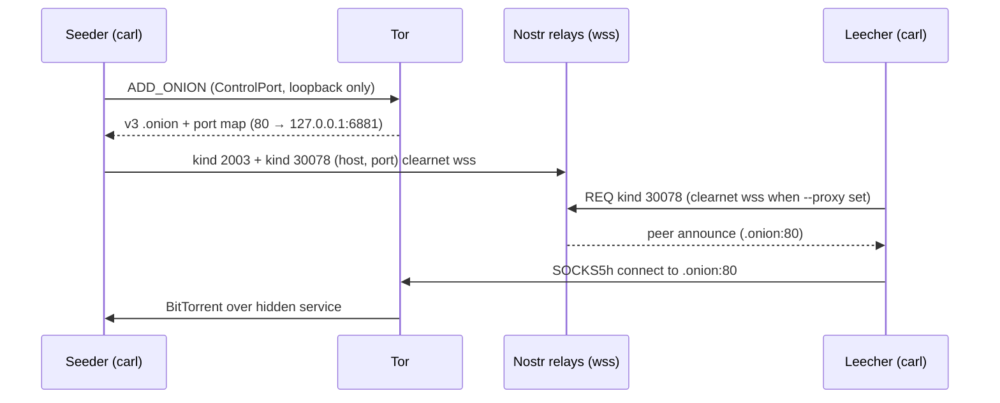

# Tor hidden-service seeding

Carl can seed a torrent behind an **ephemeral Tor v3 hidden service** and publish
the `.onion` endpoint on Nostr (NIP-35 kind 30078). Remote leechers discover the
onion via `carl download --nostr` and connect through Tor SOCKS — no public
BitTorrent port or routable IPv4 is required on the seeder.

This document covers setup, the **relay vs peer proxy split**, security
properties, a verified end-to-end test, and known limitations.

## Quick start

### Seeder (Mac or Linux)

Tor must expose **ControlPort** with **cookie authentication** and **SOCKS5**:

```sh
# Example minimal torrc (adjust DataDirectory for your install)
# ControlPort 9051
# CookieAuthentication 1
# SocksPort 9050

carl seed file.torrent /path/to/data \
  --tor-seed --nostr \
  --description "My release"
```

Optional flags:

| Flag | Default | Purpose |
|------|---------|---------|
| `--tor-control` | `127.0.0.1:9051` | Tor ControlPort `host:port` |
| `--tor-cookie` | `~/.tor/control_auth_cookie` | Control cookie file |
| `--tor-onion-port` | `80` | Virtual port on the onion (maps to local `--port`) |
| `--tor-socks` | `socks5h://127.0.0.1:9050` | Parsed for API symmetry; see [Proxy split](#proxy-split-nostr-wss-vs-bitTorrent-tcp) |
| `--port` | `6881` | Local BitTorrent listen port (bound to loopback only) |

`--tor-seed` requires `--nostr` and is **mutually exclusive** with `--proxy` and
`--external-ip` on `carl seed`.

### Leecher (any host with Tor SOCKS)

```sh
# Install tor, ensure SOCKS on 127.0.0.1:9050
carl download file.torrent --output-dir ./out \
  --nostr --proxy socks5h://127.0.0.1:9050
```

Use a `.torrent` file or magnet with a known infohash. For magnet-only downloads,
metadata exchange over Tor peers can be slow; prefer a `.torrent` when testing.

## How it works



1. **`tor_control.zig`** — `ADD_ONION NEW:ED25519-V3`, parse `ServiceID`, build
   `{service_id}.onion`, `DEL_ONION` on shutdown.
2. **`session.zig`** — listener on `127.0.0.1` only; tracker/DHT announces
   disabled (`tor_hidden` mode).
3. **`peer_announce.zig`** — kind 30078 with `host` + `port` tags (no `ip` tag).
4. **`peer.zig`** — `connectThroughProxyHost` for `.onion` when `--proxy` is set.
5. **`relay.zig`** — Nostr relay connections use clearnet `wss` when `--proxy` is
   set (see below).

## Kind 30078 schema

| Mode | Tags | Example |
|------|------|---------|
| IPv4 seed (`--external-ip`) | `d`, `ip`, `port`, `client` | `ip=203.0.113.7`, `port=6881` |
| Tor seed (`--tor-seed`) | `d`, `host`, `port`, `client` | `host=….onion`, `port=80` |

- `d` — 40-char hex infohash (NIP-33 replaceable key).
- `port` — BitTorrent port as seen by leechers (onion virtual port, default 80).
- `client` — `carl/0.1`.

**Parsing rule:** if a valid v3 `host` (`.onion`) tag is present, it **wins**
over an `ip` tag. That prevents a signed event from advertising a routable IPv4
alongside an onion and tricking proxied leechers into clearnet dials.

IPv4 addresses in `ip` tags must pass `isRoutable()` (no loopback, private, or
multicast ranges).

## Proxy split: Nostr `wss` vs BitTorrent TCP

When `--proxy` (or leecher Tor SOCKS) is active, Carl applies the proxy **only
where it is safe and implemented today**:

| Traffic | With `--proxy` | Notes |
|---------|----------------|-------|
| BitTorrent peer TCP (IPv4) | Tunneled via SOCKS5h | Standard proxied mode |
| BitTorrent peer TCP (`.onion`) | **Required** — tunneled via SOCKS5h | Without `--proxy`, onion peers are skipped with a warning |
| `http(s)://` trackers | Tunneled | Same as [proxy.md](proxy.md) |
| Nostr relay `wss://` | **Clearnet** (proxy stripped) | Proxied WebSocket+TLS is not implemented; avoids crashes |
| UDP / DHT | Disabled | Fail-closed with `--proxy` |

Implementation: `relay.effectiveRelayProxy()` returns `null` for `wss://` and
`ws://` URLs so `ws.Conn` uses `std.http.Client` (stable on Zig 0.15). Direct
`ws.Conn.connect(..., .{ .proxy = px })` on `wss://` returns `ConnectFailed`.

**Privacy implication:** `--tor-seed` hides your BitTorrent endpoint behind Tor,
but **Nostr relay subscriptions and publishes still use clearnet `wss`** today.
Your IP may be visible to relay operators. `--tor-socks` does not change that
until proxied `wss` is implemented.

## Tor ControlPort security

Production hardening in `tor_control.zig`:

- **Loopback only** — `--tor-control` must resolve to `127.0.0.1`, `localhost`,
  or `::1`. Non-loopback hosts are refused (cookie auth is cleartext on the wire).
- **ServiceID validation** — 56-character base32 before `DEL_ONION` (no `\r\n`
  injection in control commands).
- **Cookie read** — up to 256 bytes; `AUTHENTICATE` command built in a growable
  buffer (large cookies do not truncate silently).

Use a dedicated Tor instance or torrc for Carl; Homebrew Tor may use
`/opt/homebrew/var/lib/tor/control_auth_cookie` instead of `~/.tor/`.

## Leecher requirements

1. **Tor SOCKS** — `socks5h://127.0.0.1:9050` (remote DNS; required for `.onion`).
2. **`--nostr`** — subscribe to kind 30078 for the torrent infohash.
3. **No inbound listener** — proxied download mode does not bind a public port
   (same as [proxy.md](proxy.md)).
4. **Peer source** — with `--proxy`, DHT and UDP trackers are off; peers come from
   Nostr (and any `http(s)://` tracker in the torrent). Trackerless magnets need
   Nostr peers or an HTTP tracker.

Carl logs `added N peers from nostr` when kind 30078 events are found.

## Verified end-to-end test (2026-06-03)

| Step | Environment | Result |
|------|-------------|--------|
| Build | `zig build` / `zig build test` | Pass |
| Seed | macOS, `--tor-seed --nostr`, custom torrc + cookie | Onion created; kind 2003/30078 on Damus + nos.lol |
| Search | VPS `65.108.246.14`, `carl search "bitcoin"` | Found `bitcoin.pdf` |
| Download | VPS, `.torrent` + `--nostr --proxy socks5h://127.0.0.1:9050` | Complete; SHA-256 matched seeder file |
| Integrity | `b1674191…f4f553` | Match |

**Infohash tested:** `08d72b48f0799bbf62a2dc54cb66cb1ed14f9431` (bitcoin.org whitepaper).

**Not required:** public `6881` on the seeder; `nc <public-ip> 6881` from the VPS.

**Caveats observed:**

- First download attempt with a pre-allocated sparse file showed zeros until a
  clean run completed — use a fresh `--output-dir` when re-testing.
- Magnet-only download may stall on ut_metadata over slow Tor paths; `.torrent`
  file download is more reliable for tests.

## What is disabled in `--tor-seed` mode

- Public IPv4 in kind 30078 (`--external-ip` forbidden).
- BitTorrent listener on `0.0.0.0` (loopback only).
- Tracker and DHT announces (no real IP leaked to trackers).
- Incoming peers from the public internet (only Tor circuits to the onion).
- `--proxy` on seed (use Tor hidden service instead).

## Known limitations and follow-ups

| Item | Status |
|------|--------|
| Proxied `wss://` (Nostr over Tor SOCKS) | **Not implemented** — clearnet fallback in `relay.zig` |
| `--tor-socks` tunneling Nostr | Documented; same as above until `wss` over SOCKS works |
| Magnet metadata only over onion | May be slow; prefer `.torrent` for reliability |
| Web seeds over proxy | Disabled ([proxy.md](proxy.md)) |
| UDP / DHT with `--proxy` | Disabled |
| IPv6 | Not supported |
| Persistent onion | Ephemeral `ADD_ONION` only; new onion each run |
| Multi-file torrents in magnet metadata mode | Limited ([session.zig](../src/session.zig)) |

**Follow-up work:** implement stable `wss` over SOCKS (or HTTP-client WebSocket
upgrade over a CONNECT tunnel) so relay traffic can match BitTorrent anonymity
expectations when using `--tor-seed` / `--tor-socks`.

## Troubleshooting

| Symptom | Likely cause |
|---------|----------------|
| `tor hidden service setup failed: AuthFailed` | Wrong `--tor-cookie` path (check Homebrew `DataDirectory`) |
| `refusing non-loopback Tor control host` | `--tor-control` must be local |
| `ADD_ONION error` / `InvalidResponse` | Tor not bootstrapped, ControlPort disabled, or two Tor instances fighting |
| `nostr peer … is a .onion host; use --proxy` | Leecher missing `--proxy socks5h://…` |
| Search with `--proxy` works but no peers | Use `--nostr` on download; check kind 30078 on relays |
| Download 0 bytes / wrong hash | Stale output dir; retry with empty directory |
| Segfault on `wss` + `--proxy` | Fixed: upgrade to branch with `relay.effectiveRelayProxy` |

## Related docs

- [proxy.md](proxy.md) — SOCKS5h, fail-closed proxied mode, leak verification
- [brainstorms/2026-06-03-tor-hidden-service-peer-announce.md](brainstorms/2026-06-03-tor-hidden-service-peer-announce.md) — design notes
- [README.md](../README.md) — CLI examples

## Source files

| File | Role |
|------|------|
| `src/tor_control.zig` | ControlPort cookie auth, `ADD_ONION` / `DEL_ONION` |
| `src/peer_announce.zig` | Kind 30078 build/parse (IPv4 and onion) |
| `src/main.zig` | `--tor-seed` CLI, `publishNostrOnion`, `collectNostrPeers` |
| `src/session.zig` | Loopback bind, `tor_hidden`, `connectOnionPeer` |
| `src/relay.zig` | `effectiveRelayProxy` (clearnet `wss` when `--proxy` set) |
| `src/ws.zig` | `wss` via `std.http.Client`; rejects direct `wss`+proxy |
| `src/proxy.zig` | SOCKS5h host connect (used for `.onion` peers) |